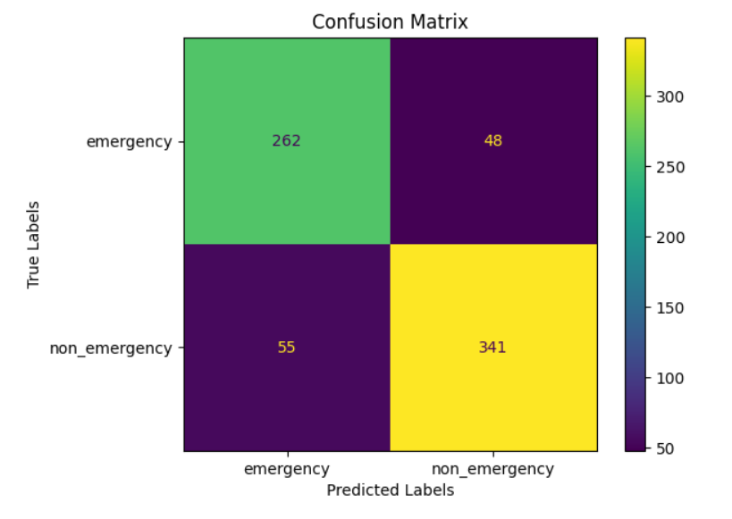

# Emergency Vehicle Detection Using Convolutional Neural Networks

## 📌 Overview  
This project implements a Convolutional Neural Network (CNN) to classify images of **emergency** vs **non-emergency** vehicles.  
The system is designed with dropout layers and optimized training to reduce overfitting, and results are evaluated using accuracy, loss curves, and a confusion matrix.  

Potential applications include:  
- Smart traffic management (prioritizing emergency vehicles)  
- Autonomous vehicle systems with emergency response recognition  

---

## 🛠️ Tools & Technologies  
- Python, Jupyter Notebook  
- TensorFlow / Keras (CNN architecture, Dropout)  
- Pandas / NumPy for data handling  
- Matplotlib / Seaborn for visualization  

---

## 📂 Dataset  
- Source: [Emergency Vehicle Detection Dataset – Kaggle](https://www.kaggle.com/datasets/ambityga/emergency-vehicle-detection)  
- Classes: `emergency`, `non_emergency`  
- Images: 700+ labeled vehicle images  

---

## 🔍 Methodology  
1. **Data Preprocessing**  
   - Resizing, normalization, and data augmentation (flips, rotations)  
2. **Model Architecture**  
   - Convolutional + MaxPooling layers  
   - Dropout layers to mitigate overfitting  
   - Fully connected dense layers with softmax output  
3. **Training**  
   - Optimizer: Adam  
   - Loss: Categorical Cross-Entropy  
   - Regularization via dropout and early stopping  
4. **Evaluation**  
   - Accuracy and loss curves  
   - Confusion matrix and classification report  

---

## 📊 Results & Insights  
- **Classification Report:**  
  - Accuracy = **85%**  
  - Precision = 0.83 (non-emergency), 0.88 (emergency)  
  - Recall = 0.85 (non-emergency), 0.86 (emergency)  
  - Macro F1 = **0.85**  
- Balanced performance across both classes.  
- Dropout successfully reduced overfitting and improved generalization.  

---

## 📈 Example Visuals  

Confusion Matrix:  



---

## 🚀 How to Run This Project  
1. Clone this repository:  
   ```bash
   git clone https://github.com/Josefxl/Emergency_Vehicle_Detection_Using_Convolutional_Neural_Networks.git
